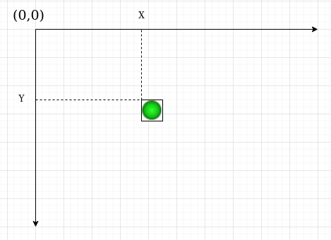
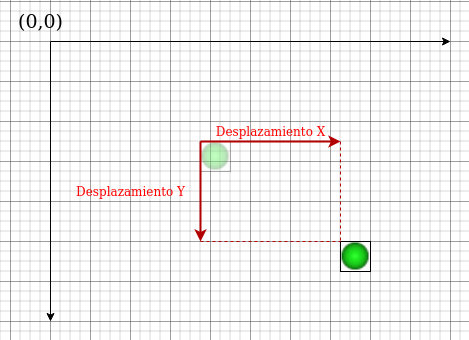

# pyGame: Realizando juegos con Python

Aunque el desarrollo de videojuegos en la actualidad, es una actividad multidisplinar, en las que se necesita a muchos profesionales de diversos campos, esta actividad puede ser muy adecuada para introducir a nuestros alumnos en la programación, y en el desarrollo del pensamiento computacional. 

La programación de videojuegos es un caso particular de la programación de un software, por lo tanto vamos a desarrollar las capacidades de nuestros alumnos de abstracción, de encontrar soluciones a determinados problemas y de desarrollar un programa de ordenador que solucione dichos problemas, pero además podemos conseguir que nuestros alumnos consigan otras destrezas como pueden ser: el trabajo colaborativo en grupo, el desarrollo de la creatividad o el aumento de la motivación y la confianza en afrontar nuevos retos.

Python es un lenguaje de programación muy adecuado para introducirse en el mundo de la programación. Además, en este caso concreto, en el desarrollo de videojuegos, Python nos ofrece varias librerías que nos facilitan la creación de videojuegos. En este recurso vamos a usar el módulo [pyGame](https://www.pygame.org/news), que permiten la creación de videojuegos en dos dimensiones de una manera sencilla. Mediante PyGame podemos utilizar sprites (objetos), cargar y mostrar imágenes en diferentes formatos, sonidos, etc. Además, al ser un módulo destinado a la programación de videojuegos se puede monitorizar el teclado o joystick de una manera bastante sencilla.

## ¿Qué debo saber para empezar a trabajar con este recurso?

### Niveles a los que va dirigido

Bachillerato y Formación Profesional

### Asignatura/s

### ¿Se requieren conocimientos previos?¿cuáles son?

### ¿Qué objetivos se persigue con el recurso?


### ¿En qué consiste el recurso?

En este recurso vamos a introducir el desarrollo de un pequeño juego, usando la librería pyGame de Python. Vamos a crear un juego donde tenemos una pelota que va rebotando en las pareces de la ventana y controlamos una plataforma en la parte inferior de la pantalla. El jugador tiene que evitar que la pelota llegue al borde inferior de la ventana.

## Y ahora que sé para que sirve, ¿cómo lo pongo en práctica?

Vamos a crear distintos programas que nos vayan acercando a la versión final del juego. Cada programa lo podemos construir en una sesión de clase para que el alumno le de tiempo de ir asimilando el funcionamiento. Empecemos:

### Sesión 1: Construir la ventana del juego

En esta primera sesión, vamos a crear y configurar la ventana que vamos a usar posteriormente para dibujar los elementos de nuestro juego.

Lo primero que tenemos que entender es la estructura que va a tener los juegos que desarrollemos con pyGame:

1. **Se crea y configura la ventana del juego**, con los elementos que va a tener nuestro juego.
2. **Se comprueban los eventos**: Dentro de un bucle, comprobamos los posibles eventos que se han producido, por ejemplo, hemos pulsado el botón de cierre de la ventana y el juego concluye, o hemos pulsado una determinada tecla,...
3. **Se actualiza la pantalla**: Según la lógica del juego o de algún evento que haya sucedido, se interacciona con los elementos de la ventana (se mueve la pelota, se mueve la plataforma,...) y se vuelve a dibujar los elementos de la pantalla.

En esta primera sesión vamos a crear un programa, que nos muestra una ventana sin ningún elemento. Este programa puede servir a los alumnos como plantilla para que desarrollen sus propios juegos. El primer ejemplo lo tenemos en el fichero [`ejercicio1.py`](ejercicio1.py) y sería el siguiente:

```python
import pygame
# Inicialización de Pygame
pygame.init()
# Inicialización de la superficie de dibujo
ventana = pygame.display.set_mode((640,480))
pygame.display.set_caption("Ejemplo 1")
# Bucle principal del juego
jugando = True
while jugando:
    # Comprobamos los eventos
    #Comprobamos si se ha pulsado el botón de cierre de la ventana
    for event in pygame.event.get():
        if event.type == pygame.QUIT:
            jugando = False
    # Se pinta la ventana con un color
    # Esto borra los posibles elementos que teníamos anteriormente
    ventana.fill((255, 255, 255))
    # Todos los elementos del juego se vuelven a dibujar
    pygame.display.flip()
    # Controlamos la frecuencia de refresco (FPS)
    pygame.time.Clock().tick(60)
pygame.quit()
```

Veamos con detalle el programa:

1. Es necesario importar el módulo pygame (`import pygame`) y a continuación se inicializaría el módulo (`pygame.init()`).
2. Creamos y configuramos la ventana del juego:
    * Con `pygame.display.set_mode` se crea una ventana con el tamaño señalado. Se genera un objeto `ventana` que representa nuestra ventana de juego.
    * Con `pygame.display.set_caption` se configura el título de la ventana.
3. La parte central del programa es un bucle que repite las siguientes instrucciones:
    * El método `pygame.event.get()` nos devuelve una lista con los posibles eventos que han sucedido en el juego. Usamos una instrucción `for` para comprobar esta lista de eventos.
    * En este ejemplo, comprobamos el evento de pulsar el botón de cierre de la ventana. Esto ocurre cuando el tipo de evento (`event.type`) es igual al valor `pygame.QUIT`. Si esta condición ocurre se modificará la variable `jugando` que hará que el bucle principal del juego termine.
    * En el bucle principal se actúa sobre los elementos de la ventana. En nuestro caso no tenemos ninguno.
    * Se borran los posibles elementos que tengamos, pintando la pantalla de un color: `ventana.fill((252, 243, 207))`. en este caso usando la notación [RGB](https://es.wikipedia.org/wiki/RGB) lo pintamos de amarillo claro.
    * Volvemos a pintar lo elementos en su nueva posición: `pygame.display.flip()`, controlando en todo momento ls frecuencia de refresco de la imagen ([fps](https://es.wikipedia.org/wiki/Fotogramas_por_segundo)) sea de 60.
4. Si salimos del bucle principal se he terminado el programa: `pygame.quit()`.

Si ejecutamos el programa: `python3 ejemplo1.py`, nos debe aparecer una ventana como esta:


### Sesión 2: Añadimos la pelota a nuestro juego

En esta sesión vamos a modificar el ejemplo anterior, para incluir el primer objeto a nuestro juego: una pelota que se moverá e ira rebotando por los bordes de la ventana.

La pelota va a ser un imagen que tenemos en nuestro directorio: [`ball.png`](ball.png). El `ejmplo2.py` quedaría de la siguiente forma:

```python
import pygame
pygame.init()
ventana = pygame.display.set_mode((640,480))
pygame.display.set_caption("Ejemplo 2")
# Crea el objeto pelota.
ball = pygame.image.load("ball.png")
# Obtengo el rectángulo del objeto anterior
ballrect = ball.get_rect()
# Incializo los valores con los que se van a mover la pelota
speed = [4,4]
# Pongo la pelota en el origen de coordenadas
ballrect.move_ip(0,0)
jugando = True
while jugando:
    for event in pygame.event.get():
        if event.type == pygame.QUIT:
            jugando = False
    # Muevo la pelota
    ballrect = ballrect.move(speed)
    # Compruebo si la pelota llega a los límites de la ventana
    if ballrect.left < 0 or ballrect.right > ventana.get_width():
        speed[0] = -speed[0]
            
    if ballrect.top < 0 or ballrect.bottom > ventana.get_height():
        speed[1] = -speed[1]
    
    ventana.fill((252, 243, 207))
    ventana.blit(ball, ballrect)
    pygame.display.flip()
    pygame.time.Clock().tick(60)
pygame.quit()
```

Antes de explicar las nuevas instrucciones que hemos introducido en este ejemplo, tenemos que aprender como posicionamos y movemos los objetos dentro de la ventana. Cada objeto se representa por el rectángulo que ocupa, y se posiciona en la ventana indicando la ordenada X (posición horizontal) y la ordenada Y (posición vertical). Tenemos que saber que el origen de coordenadas (0,0) se encuentra en la esquina superior izquierda. 



Para mover un objeto necesitaremos dos valores: uno para indicar el desplazamiento lateral (ordenada X), si es positivo desplazaremos el objeto a la derecha, si es negativo a la izquierda; y otro para indicar el desplazamiento vertical (ordenada Y), si es positivo se moverá hacia abajo, si es negativo hacía arriaba.



## ¿Qué habilidades de los alumnos desarrollo que no se pueden obtener de manera más tradicional?


## ¿Qué ventaja obtengo de utilizar este recurso en el aula?


## ¿Qué materiales necesito para ponerlo en práctica en el aula?