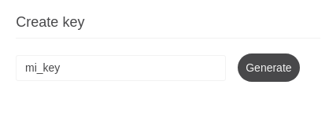
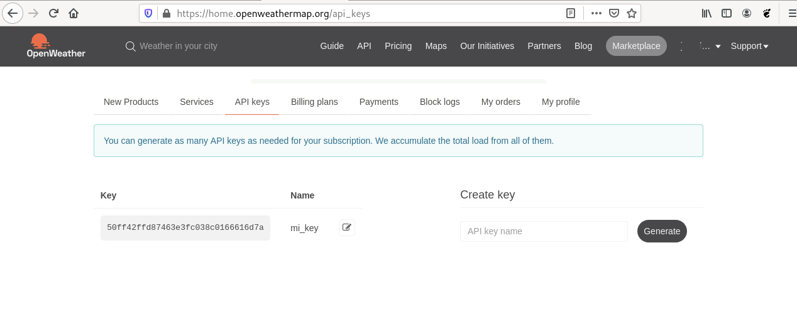
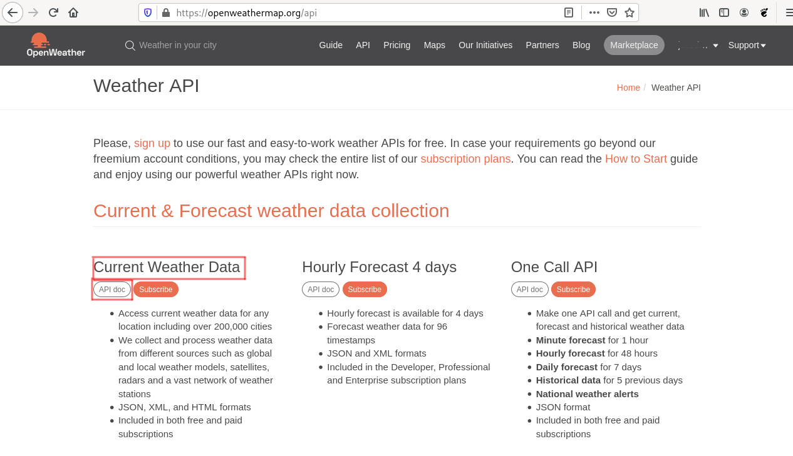
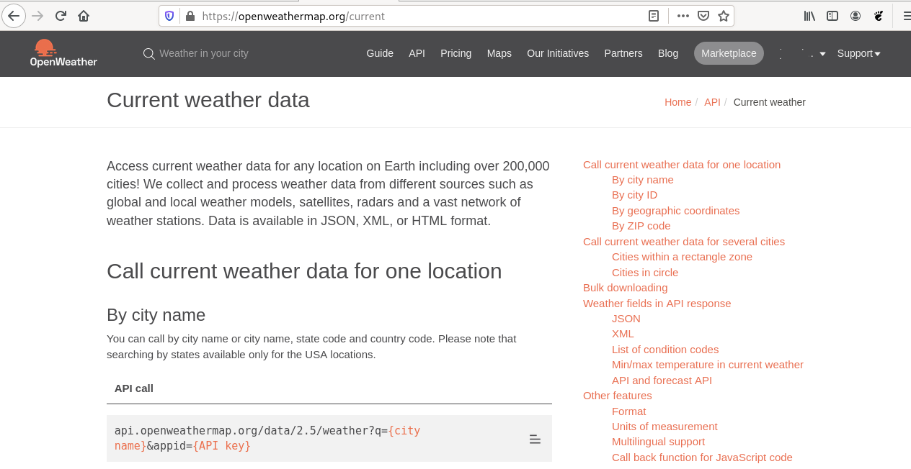

# Consulta el tiempo atmosférico con Python

Un programa de ordenador recibe datos de entrada, de forma automática, procesa esos datos y genera una información de salida.

Los datos de entrada, normalmente son introducidos por el usuario. En otras ocasiones, los datos con los que trabaja el programa, están guardados en ficheros o en bases de datos. Pero, ¿y si pudiéramos utilizar los datos que tenemos disponible en internet como entrada para nuestros programas?

Actualmente, una de las fuentes de información más importantes que tenemos son las páginas web disponibles en internet. Los usuarios podemos consultar distintas páginas web y la información se nos muestra con un formato determinado, lenguaje HTML, pensado para representar la información de manera sencilla.

Sin embargo, ¿podríamos crear programas que tomaran como datos de entrada la información ofrecida por alguna página web?. La respuesta es sí, pero no vamos a utilizar directamente una página web, vamos a usar lo que conocemos como **Servicio web**. Hay distintos tipos de Servicios Web, nosotros vamos a utilizar los servicios [REST](https://es.wikipedia.org/wiki/Transferencia_de_Estado_Representacional) (RESTful web API) que son un mecanismo de comunicación que nos permiten comunicar un programa con otro. En este caso la información que se comparte tiene que estar estructurada para que su gestión y tratamiento con un programa sea lo más sencilla posible. En este recurso el lenguaje que estructura la información que vamos a utilizar será JSON.

## ¿Qué debo saber para empezar a trabajar con este recurso?

### Niveles a los que va dirigido

Bachillerato y Formación Profesional

### Asignatura/s

En Bachillerato este recurso se podría utilizar en cualquier asignatura donde se este impartiendo conceptos de introducción a programación con Python. En Formación Profesional, este recurso puede ser apropiado, para los ciclos de la Familia Profesional de Informática donde se imparta la introducción a la Programación.

### ¿Se requieren conocimientos previos?¿cuáles son?

El recurso tiene un nivel de dificultad medio. Es necesario que el alumnado tenga conocimientos previos de programación con Python: instalación de python en el sistema operativo, estructura de un programa, ejecución de un programa, trabajo con datos, tipos de datos y variables, estructuras de programación: secuencial, alternativas y repetitivas, trabajo con listas y diccionarios.

Estaría muy bien que el alumno tenga algunos conocimientos del protocolo HTTP: como funciona las peticiones a las páginas web, qué es una petición y una respuesta HTTP,... De todas maneras el recurso se puede realizar sin tener estos conocimientos.

### ¿Qué objetivos se persigue con el recurso?

Los objetivos de este recurso son los siguientes:

* Introducir el concepto de **Servicio Web**, como mecanismo de comunicación entre programas en internet. En este recurso introduciremos los Servicios Web del tio RESTful API.
* Introducir el lenguaje de marcas JSON, que actualmente es uno de los más usado para estructurar la información que se transmite por internet.
* Aprender a crear programas en Python que se comuniquen con un Servicio Web y que nos posibilite el tratamiento automático de la información que vamos a consumir del Servicio Web.
* Desarrollar en los alumnos la habilidad de crear programas que traten de forman automática información recogida de internet.  
* El alumno aprenderá que es necesario que cierta información que podemos obtener, por ejemplo de la administración pública, tenga mecanismos y formatos abiertos para que sea sencillo su tratamiento.

### ¿En qué consiste el recurso?

Vamos a desarrollar un programa en Python que nos posibilite consultar el tiempo atmosférico que tenemos en nuestra ciudad. Para ello el programa, se comunicará con el servicio web RESTful API de *openweather*.

## Y ahora que sé para que sirve, ¿cómo lo pongo en práctica?

### Paso 1: Entendiendo la diferencia entre aplicación web y servicio web

Como ya hemos presentado en la introducción del recurso, las páginas web o aplicaciones web están pensada para que las personas consulten información. De esta manera si quiero saber los datos atmosféricos de mi ciudad puedo a acceder a la página [openweathermap.org](https://openweathermap.org) y hacer una búsqueda de mi ciudad:


Los datos son recibidos utilizando el lenguaje HTML y utilizando Hojas de Estílo (CSS) para darle formato. De esta manera la persona recibe está información de manera muy clara.

Pero, ¿y si queremos desarrollar un programa que haga la misma consulta y que pueda procesar esa información de forma automática? En este caso necesitaríamos consultar el servicio web RESTful de openweather: [https://openweathermap.org/api](https://openweathermap.org/api) y la información recibida vendría estructurada con otro lenguaje de marcado, en nuestro caso utilizaremos JSON, para que sea fácil procesarlo desde nuestro programa. Lo vemos en el siguiente punto.

### Paso 2: Usando el servicio web RESTful de OpenWeather

Aunque algunos servicios web RESTful se pueden usar sin ninguna restricción, otros, como el de OpenWeather, es necesario que nos identifiquemos para su utilización. En este caso el proceso de autentficación se hace mediante una clave personal (**API key**). Lo primero que vamos a hacer es obtener nuestra clave personal, para ello:

1. Nos registramos en la página de OpenWeather.
2. Accedemos con el usuario y contraseña que hemos indicado.
3. Accedemos al apartado *API Keys* y generamos una nueva key.

    

Ya podemos ver la clave que hemos generado. Tenemos que tener en cuenta que esta clave es como nuestra contraseña, nos identifica en el servicio web, por lo que es importante que la protejamos de forma adecuada.



Una vez que tenemos nuestra API key, vamos a usar por primera vez una API RESTful de OpenWeather. 

En realidad el uso es muy parecido a acceder a una página web, es decir, vamos a hacer una petición HTTP a una URL que nos devolverá una información determinada. Normalmente las URL de las API RESTful tienen una serie de parámetros que nos permiten configurar la consulta. Y una vez que hagamos la petición obtendremos una respuesta HTTP que nos devolverá una información con una cierta estructura. La pregunta sería: ¿Cómo sabemos las URL, los parámetros y la estructura de la información recibida de una API RESTful? Para saber todos esos datos necesitamos estudiar la documentación de la API RESTful que queremos usar.

Accedemos a la opción *API* y nos aparecerán los distintos servicios web que podemos usar. Nosotros, para la realización de este recurso, vamos a usar **Current Weather Data**:



Pulsamos sobre la opción *API doc* y accedemos a la documentación de esta API:



En la documentación podemos aprender muchas cosas:

* Las URL que que tengo que usar para realizar búsqueda de ciudades: por nombre, por identificador, por coordenadas geográficas, por códigos postales,...
* Los parámetros que puedo indicar en la URL para configurar la consulta.
* La estructura de la información recibida.

En nuestro caso vamos a hacer una consulta de una ciudad por nombre, por lo que la URL que voy a usar es:

`api.openweathermap.org/data/2.5/weather`

Los parámetros que voy a indicar serán:

* `q`: Para indicar el nombre de la ciudad.
* `appid`: Para indicar la API key.
* `units`: Para indicar las unidades de medidas. Vamos a usar `metric`.

Por lo tanto, si queremos consultar la ciudad "Sevilla", tenemos que hacer una petición a la URL:

`https://api.openweathermap.org/data/2.5/weather?q=Sevilla&appid=50ff42ffd87463e3fc038c0166616d7a&units=metric`

Vamos a usar un navegador web para obtener la salida de una forma más visual, si elegimos la opción de *Datos sin procesar*, podremos ver la información devuelta en su formato JSON original:


### Paso 3: Introducción a JSON

El lenguaje de marcas JSON nos sirve para estructurar información de distinto tipo: números, cadenas de caracteres, booleanos, arrays y objetos. Los arrays representa una lista de datos guardada entre corchetes (`[` y `]`) y los objetos son colecciones no ordenadas de pares de la forma **<clave>:<valor>**, separados por comas y guardadas entre llaves (`{` y `}`).

La consulta anterior que hemos realizado nos ha devuelto la siguiente información:

```json
{
  "coord": {
    "lon": -5.9761,
    "lat": 37.3824
  },
  "weather": [
    {
      "id": 800,
      "main": "Clear",
      "description": "clear sky",
      "icon": "01d"
    }
  ],
  "base": "stations",
  "main": {
    "temp": 24.04,
    "feels_like": 23.96,
    "temp_min": 22.95,
    "temp_max": 24.44,
    "pressure": 1017,
    "humidity": 56
  },
  "visibility": 10000,
  "wind": {
    "speed": 2.24,
    "deg": 58,
    "gust": 4.47
  },
  "clouds": {
    "all": 0
  },
  "dt": 1623052825,
  "sys": {
    "type": 2,
    "id": 2011488,
    "country": "ES",
    "sunrise": 1623042197,
    "sunset": 1623094954
  },
  "timezone": 7200,
  "id": 2510911,
  "name": "Seville",
  "cod": 200
}
```

Aquí podemos encontrar toda la información meteorológica de la ciudad de Sevilla. Nosotros posteriormente nos quedaremos con el objeto cuya clave es `main` donde encontramos la temperatura actual (`temp`), la sensación térmica (`feels_like`), la temperatura mínima (`temp_min`), la máxima (`temp_max`), la presión (`pressure`) y la humedad (`humidity`).

Cuando trabajamos con JSON desde un programa Python, los arrays JSON se convierten en listas Python, y los objetos JSON se convierten en diccionarios Python. Lo veremos en el siguiente punto:

### Paso 4: ¿Cómo hacemos un programa Python que haga una consulta al servicio web de OpenWeather?

Vamos a usar el módulo [`requests`](https://docs.python-requests.org/en/master/) para poder hacer peticiones HTTP a la URL del servicio web que vamos a utilizar. El código fuente del programa lo podemos encontrar en el fichero [`programa.py`](programa.py) y quedaría de la siguiente forma:

```python
import requests
# Pedimos el nombre de la ciudad por teclado
ciudad=input("Dime el nombre de una ciudad:")
# Creamos un diccionario con los parámetros de la URL
parametros={"q":ciudad,
            "units":"metric",
            "APPID":"50ff42ffd87463e3fc038c0166616d7a"}
# Realizamos la petición, indicando la URL y los parámetros
respuesta=requests.get("http://api.openweathermap.org/data/2.5/weather",params=parametros)
# Si la respuesta devuelve el código de estado 200, todo ha ido bien
if respuesta.status_code == 200:
    # La respuesta json se convierte en un diccionario
    datos = respuesta.json()
    # Se obtienen los valores del diccionario
    print("La temperatura actual es:",datos["main"]["temp"],"ºC")
    print("La sensación térmica es:",datos["main"]["feels_like"],"ºC")
    print("La temperatura mínima es:",datos["main"]["temp_min"],"ºC")
    print("La temperatura máxima es:",datos["main"]["temp_max"],"ºC")
    print("La presión es:",datos["main"]["pressure"],"hPa")
    print("La humedad es:",datos["main"]["humidity"],"%")
else:
    print("De esa ciudad no tengo datos.")
```
Veamos con detalle el programa:

1. Importamos el modulo `requests` (`import requests`).
2. A continuación pedimos el nombre de la ciudad por teclado.
3. Creamos un diccionario donde vamos a guardar los nombres de los parámetros de la url y sus valores. Al parámetro `q` asignamos el valor de la variable `ciudad`, donde hemos guardado el nombre de la ciudad. Usar un diccionario para guardar los parámetros de la URL facilita el trabajo con ellos.
4. Al hacer la petición con el módulo `requests` indicamos la url y sus parámetros (`params=parametros`). La petición nos va a devolver la información de la respuesta HTTP que guardaremos en el objeto `respuesta`.
5. Comprobamos si la respuesta HTTP ha sido correcta, para ello comprobamos que el [código de estado](https://es.wikipedia.org/wiki/Anexo:C%C3%B3digos_de_estado_HTTP) sea 200 (`if respuesta.status_code == 200:`), si devuelve otro valor, ha habido un problema, y mostramos el mensaje "De esa ciudad no tengo datos.".
6. Si la petición ha sido correcta, convertimos la información devuelta, con formato JSON, a un diccionario llamado `datos`. Esto lo hacemos con el método `json()`: `datos = respuesta.json()`.
7. Finalmente imprimimos los datos de salida que están guardados en el diccionario `datos`.

Veamos la ejecución del programa:

```bash
$ python3 programa.py 
Dime el nombre de una ciudad:Sevilla
La temperatura actual es: 24.04 ºC
La sensación térmica es: 23.96 ºC
La temperatura mínima es: 22.95 ºC
La temperatura máxima es: 24.44 ºC
La presión es: 1017 hPa
La humedad es: 56 %
```

## ¿Qué habilidades de los alumnos desarrollo que no se pueden obtener de manera más tradicional?

En muchas ocasiones, los programas que se desarrollan en las asignaturas de iniciación a la programación no trabajan con una gran cantidad de datos, o estos datos no son reales. 

Con el desarrollo de programas que se comuniquen con los Servicios Web que tenemos disponibles en Internet, se pueden hacer programas más reales que nos posibilite el trabajo con información más real.

## ¿Qué ventaja obtengo de utilizar este recurso en el aula?

El trabajo con Servicios Web nos da la posibilidad de crear programa que obtengan información de distinto tipo, relacionada con distintas asignaturas. Sería muy sencillo realizar proyectos en el que se desarrollen programas para el tratamiento automático de información que se puedan usar en otras asignaturas: por ejemplo, recogida de datos para realizar cálculos estadísticos en la asignatura de matemáticas, recolección y procesamiento de datos demográficos en la asignatura de geografía, ...

## ¿Qué materiales necesito para ponerlo en práctica en el aula?

Necesitamos un ordenador con Python 3 y con la librería `requests` instalada (se puede seguir esta [guía](https://docs.python-requests.org/en/latest/user/install/#install)). Para codificar el programa podemos usar cualquier editor de texto.

Si queremos seguir trabajando con Servicios Web, podemos encontrar en internet distintas páginas que nos muestran listas de API, por ejemplo: [ProgrammableWeb](https://www.programmableweb.com/).